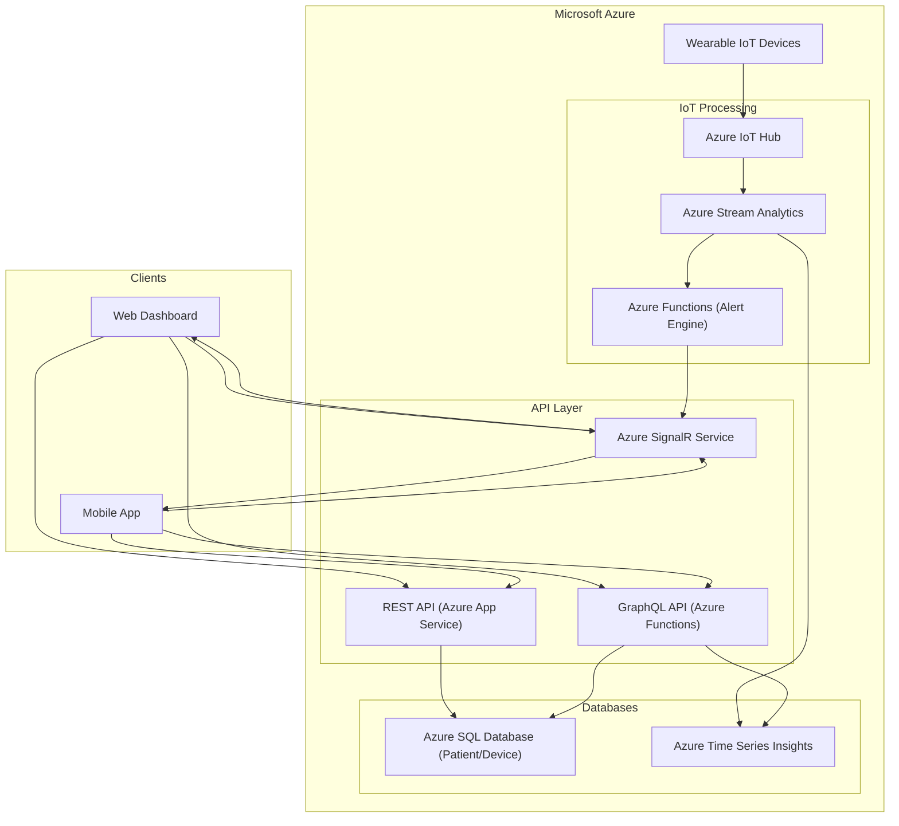

# CST8916-IoT-Remote-Healthcare-Patient-Monitoring

| | |
|---|---|
| **Semester** | Winter 2026 |
| **Release Date** | February 16, 2026 |
| **Authors** | Jingjing Duan, Ilyas Zazai, Mimi Dib |
| **Case** | #4 - Real-time IoT Monitoring System (Healthcare) |

---

[Watch Our Presentation Video!](https://)

## Overview
This report analyzes a conceptual remote data and real-time application solution used to monitor healthcare patients using IoT wearable device sensor management, real time data dashboards and alerts. 

## 1. REST and GraphQL for Data Requests and Updates
*Explain how both REST and GraphQL could be used to handle the data requests and updates required by the system.*

## 2. WebSockets for Real-time Communication
*Describe how WebSockets could be used to handle real-time communication in your chosen system.*

Server needs to push updates to the user frequently WebSocket
Real-time, bidirectional communication needed WebSocket

## 3. Technology Recommendation and Justification
### 3.1 Recommendation
For the Healthcare Remote Patient Monitoring system, I recommend a **hybrid approach**:

- **REST** for **patient/device management**
- **GraphQL** for **dashboard data queries**
- **WebSockets (WSS)** for **real-time vitals updates and alerts**

### 3.2 Justification

### 1) WebSockets are essential for real-time vitals + alerts

### 2) REST is best for “management” workflows

### 3) GraphQL is best for dashboards that need combined data

### 4) The backend pipeline supports scalability and reliability

## 4. System Architecture Diagram
*Create a diagram that illustrates the overall architecture of your system, showing how clients, APIs (REST and/or GraphQL), WebSockets, and backend services connect and interact. You may use any diagramming tool (e.g., draw.io, Lucidchart, Excalidraw, Mermaid) and include the diagram as an image in your report.*

**Data Flow**
- Device data ingestion: Wearables send telemetry to Azure IoT Hub. The stream processor validates and stores data in the time‑series database.
- Alerting: The alert engine checks for abnormal values; if found, it triggers a message via the WebSocket server.
- Management APIs: REST endpoints allow staff to register patients and devices (stored in relational DB).
- Dashboard queries: GraphQL fetches combined data from relational and time‑series databases.
- Real‑time updates: WebSocket pushes alerts and live readings to subscribed clients.

## Contribution Statement

- Jingjing
- Ilyas
- Mimi: Architectural Diagram, WebSockets for Real-time Communication report (Sections 2 & 4)
