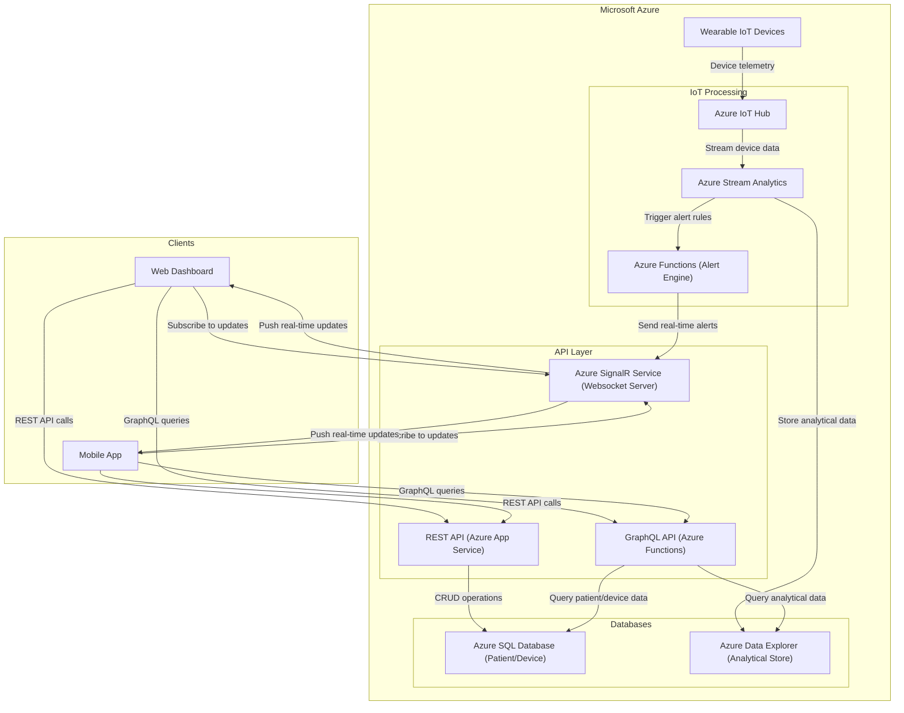

# CST8916-IoT-Remote-Healthcare-Patient-Monitoring

| | |
|---|---|
| **Semester** | Winter 2026 |
| **Release Date** | February 16, 2026 |
| **Authors** | Jingjing Duan, Ilyas Zazai, Mimi Dib |
| **Case** | #4 - Real-time IoT Monitoring System (Healthcare) |

---

[Watch Our Presentation Video!](https://)

## Overview
This report analyzes a conceptual remote data and real-time application solution used to monitor healthcare patients using IoT wearable device sensor management, real time data dashboards and alerts. 

## 1. REST and GraphQL for Data Requests and Updates
In this system, both REST and GraphQL are used to handle different types of data requests and updates.

**REST API**

REST is used for resource management and standard operations. It is well-suited for clear, structured actions such as creating, updating, or retrieving specific resources.

Examples of REST usage in this system include:
* Registering and managing patients
* Assigning devices to patients
* Retrieving historical vital records
* Acknowledging alerts
* Updating patient or device information

Typical REST endpoints may include:
* POST /patients → Create a new patient resource in the system database.
* GET /patients/{id} → Retrieve the profile and details of a specific patient by ID.
* GET /patients/{id}/vitals → Retrieve the historical and recorded vital sign data (e.g., heart rate, oxygen level) for a specific patient.

REST provides a simple and predictable structure, making it suitable for administrative tasks and CRUD operations.

**GraphQL API**

GraphQL is used for flexible and efficient data retrieval, especially for dashboard views.

In a healthcare monitoring system, the doctor dashboard may need:

* Patient profile information
* Latest vital readings
* Active alerts
* Device status

Instead of making multiple REST calls, GraphQL allows the client to request all required data in a single query.

For example, one GraphQL query can return:
* A list of assigned patients
* Each patient’s latest heart rate and oxygen level
* Any active alerts

GraphQL reduces over-fetching and under-fetching of data and provides greater flexibility for frontend applications.

**Design Decision**

In this architecture:

REST is primarily used for structured management operations.

GraphQL is used for complex dashboard data queries.

Together, they provide a balanced approach between simplicity and flexibility.

This combination ensures efficient data handling while maintaining clear system structure.

## 2. WebSockets for Real-time Communication

WebSockets integrate with HTTP to establish a full-duplex communication system, where both the client and server openly send and receive updates without the need to establish a new connection with repeated handshakes. The connection is persistent and maintained until one party closes it.

**What does this solve?**  
WebSockets allow for immediate updates to our live dashboards and action for emergencies. If we are monitoring a critical system such as live streaming of sensor data (e.g., continuous heart rate), we require low-latency communication to know the exact moment an abnormality occurs and our attention is needed. 

WebSockets reduce latency by removing the need for multiple requests, acting as an open tunnel for data updates of the patient vitals, as well as any instructions or commands sent to the IoT devices to improve data ingestion, similar to a telephone call. This allows us to alert and act on abnormalities immediately, potentially saving someone's life in the process. 

### 2.1 How WebSockets Are Implemented
Our system leverages Azure SignalR Service to implement WebSockets. It is a fully managed WebSocket server that handles connection scaling, authentication, and message broadcasting to ensure thousands of concurrent devices and clients receive updates in an instant with minimal latency.

**Data Flow Example**
1. **Live Data Stream:** Wearable IoT device records and sends telemetry data on heart rate, body temperature, etc., to Azure IoT Hub where the data will be processed in the pipeline:
    - IoT Hub ingests device data
    - Azure Stream Analytics does real-time data processing 
    - For immediate visualization, the processed data is sent through the Alert Engine, and to Azure SignalR, which broadcasts it to subscribed clients (using persistent, encrypted WSS WebSocket connection) to update the Web Dashboard and Mobile App.
2. **Live Critical Alerting:** The Azure Functions Alert Engine that the processed data was passed through is used to evaluate all incoming data and alert on any abnormalities, evaluated against predefined thresholds:
    - Any abnormal vital signs or device malfunction = alert trigger
    - Alert is pushed instantly via Azure SignalR WebSocket server to clients 
    - Both Mobile app and Web Dashboard receive the alert immediately.
   **Example:** If a patient's blood sugar vitals drop dangerously low, the Azure Functions Alert Engine evaluates this and recognizes the abnormality, sending the alert notification immediately using WebSockets to the Web Dashboard and Mobile app for doctors and nurses' rapid intervention.
3. **Dashboard Sync:** Multiple app users can monitor the same client, and with the real-time data updates via WebSockets, they all see the same data. 
    - Any actions like alert acknowledgement or updates will be broadcasted to all web/mobile users.
    - This ensures user-wide consistent understanding of patients' vital states. 

**WebSocket Connections**
How Azure SignalR WebSocket Server connects to the Web Dashboard and Mobile app clients is using TLS encrypted WS protocol, WSS. The flow acts as follows:
1. **Initial Handshake & Upgrade Request:** Client Web Dashboard/Mobile App begins with an HTTPS negotiation, requesting to upgrade the connection to WSS protocol if the server allows, using special headers (still HTTPS here):
    - `Upgrade: websocket`
    - `Connection: Upgrade`
    - `Sec-WebSocket-Key:` (randomly generated key)
    - `Sec-WebSocket-Version: 13`
2. **Upgrade Protocol Response:** Azure SignalR permits WebSocket connections and returns the request with HTTP status `101` describing `Switching Protocols` (or the like) with the following headers:
    - `Upgrade: websocket`
    - `Connection: Upgrade`
    - `Sec-WebSocket-Accept:` (a hashed value of the client key)
3. **Full-Duplex Data Frame Communication:** Client Web Dashboard/Mobile App opens a persistent connection with Azure SignalR Server, allowing for two-way data communications, breaking the live processed data into smaller, manageable pieces (frames).
4. **Connection Closed:** When either client or server closes the connection by sending a "Close" control frame, the receiver responds with a "Close" frame acknowledgement, and the TCP connection is gracefully terminated from both sides.

## 3. Technology Recommendation and Justification
Use Case: Healthcare Remote Patient Monitoring (IoT-based)

### 3.1 Recommendation
For this patient monitoring system, we recommend the use of a hybrid approach:

- REST API for patient and device management (CRUD and operational actions)
- GraphQL API for dashboard queries (flexible, aggregated views across multiple datasets)
- WebSockets (WSS) for real-time vitals streaming and alerts
This combination is appropriate for healthcare monitoring because it balances simplicity, flexibility, and true real-time delivery.

### 3.2 Justification

#### 1) Reasoning of WebSockets for real-time vitals and alerts
Remote monitoring needs the system to push updates instantly (updates vitals, abnormal readings, critical alerts). If the dashboard only used REST/GraphQL polling, clients would often send requests, which would increase cost and delay (especially under high load) With WebSockets, the server maintains a constant connection and can push updates instantly:
- Live vitals updates (e.g., heart rate, SpO₂).
- Alert notifications when parameters are exceeded.
- Device status changes (online/offline, battery low).
- Using a managed real-time layer such as Azure SignalR also helps handle scale (many coinciding clinicians/devices) without running and scaling WebSocket servers manually.

#### 2) Reasoning of REST for management workflows
Tasks like registering devices and onboarding patients, assignments are expected resource-based actions. REST fits well because endpoints are simple and consistent (CRUD-style). it’s easy to test and debug and aligns with “management” flows that are not constantly streaming.

Typical REST responsibilities in this use case:
- patient/device registration
- assigning devices to patients
- updating care plan thresholds
- acknowledging alerts - for clinicians

#### 3) Reasoning of GraphQL for dashboards
Healthcare dashboards usually require a single screen to show multiple datasets at once, for example:
- patient profile
- vitals
- historical trends
- alert history
- device status

With REST, the frontend may need multiple calls (and risk over-fetching or under-fetching) but GraphQL allows the UI to request the fields it needs in one query. THis makes dashboards easier to progress as the UI changes.
**GraphQL is especially useful when the dashboard combines data from:**
- A relational database (patients, clinicians, assignments, care plans).
- A telemetry/time-series store (vital readings over time).

#### 4) Overall reasonging for the hybrid approach
This hybrid approach is the most secure choice because it aligns with how the system behaves in real life:
- streaming and alerts need push → WebSockets.
- structured management actions are simple → REST.
- rich dashboards need flexible combined queries → GraphQL.

**It also supports scalability by separating concerns:**
- IoT ingestion and stream processing deal with high-volume telemetry.
- APIs deal with user-driven requests.
- WebSockets deal with real-time delivery to clients.

### 3.3 Security Considerations (Healthcare Context)
Security is a key justification because the system handles highly sensitive patient data.
- Device security: IoT device identity and secure device-to-cloud communication.
- User security: role-based access control (e.g., doctors can only see assigned patients) using an identity provider such as Azure AD / Entra ID.
- Encrypted transport: TLS everywhere (HTTPS for REST/GraphQL and WSS for WebSockets).

## 4. System Architecture Diagram

**Data Flow**
- **Device Data Ingestion:** Wearable IoT devices stream telemetry data, e.g., heart rate, temperature, etc., to Azure IoT Hub, which acts as the cloud entry point for all device messages.
- **Stream Processing:** Azure Stream Analytics consumes the incoming data in real-time, performing initial validation and routing. The processed telemetry is then sent to Azure Data Explorer for time-series data storage.
- **Alert Detection:** Azure Functions Alert Engine evaluates the processed data from Stream Analytics against historical and predefined thresholds to identify abnormalities such as irregular temperature or blood sugar levels. When detected, it immediately sends a push notification to Azure SignalR Service.
- **Data Management:** Staff use underlying REST API endpoints to perform CRUD operations on patients and devices, with all data stored in Azure SQL Database as a relational patient and device registry.
- **Unified Queries:** GraphQL API enables flexible queries that combine relational data from SQL Database with time-series data from Data Explorer. This allows dashboards to fetch exactly the data they need for visualizing relationships between patients and their relevant time-based data—eliminating both over-fetching and under-fetching. Since these dashboards handle large datasets and require significant bandwidth, this approach reduces the demand on underlying infrastructure.
- **Real-Time Data Transfer:** Connected clients—both Web Dashboard and Mobile App—maintain a persistent, full-duplex connection to Azure SignalR Service. This enables real-time server-to-client alerts for patient vital abnormalities, as well as client-to-server data transfer for alert acknowledgments.

## Contribution Statement

- Jingjing: REST and GraphQL for Data Requests and Updates (Section 1)
- Ilyas: Technology Recommendation and Justification + healthcare security considerations (Section 3)
- Mimi: Architectural Diagram, WebSockets for Real-time Communication report (Sections 2 & 4)
