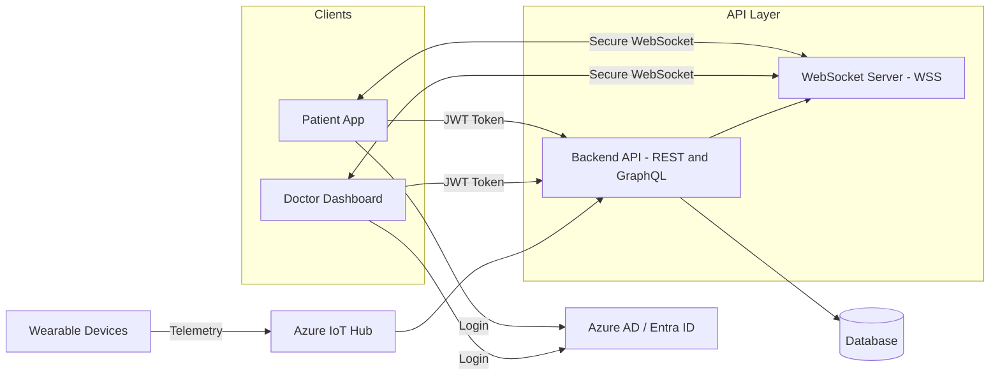

# CST8916-IoT-Remote-Healthcare-Patient-Monitoring

| | |
|---|---|
| **Semester** | Winter 2026 |
| **Release Date** | February 16, 2026 |
| **Authors** | Jingjing Duan, Iylas Zazai, Mimi Dib |

---

## Overview
This report analyzes a conceptual remote data and real-time application solution used to monitor healthcare patients using IoT wearable device sensor management, real time data dashboards and alerts. 

Wearable devices send patient health data (heart rate, oxygen level, etc.) to Azure IoT Hub, which securely manages device communication. The data is then processed and stored in the backend. If abnormal values are detected, the system generates alerts.

We can use:
REST for patient/device management
GraphQL for dashboard data queries
WebSockets for real-time updates and alerts

This keeps the design realistic, secure, and clearly shows how all three technologies work together.

Also, since this is healthcare data, we should consider security staff:
For devices management -> Azure IoT Hub
For user (e.g, only doctors can see assigned patients) ->Azure AD
For Encrypted communication ->TLS (HTTPS + WSS)
I think these security considerations might give us some extra points.

**Azure Events Hub**: Fully maanged data ingestion service to directly receive and process millions of events per second. Provides telemetry collection, log aggregation and live analytics pipelines and acts as our front door for the event pipeline between user and our analytics, storage and processing workflows. Uses HTTPS protocol and saves the streaming data automatically to Azure Blob Storage.

**Azure IoT Hub**
Our central message hub for bi-directional communication between IoT applications and wearable devices. Provides device identity management, authentication and security for millions of connected devices and supports device-to-cloud telemetry and cloud-to-device commands. 

**Azure Stream Analytics**: Analyzes our real-time data immediately once generated, allowing us  to monitor patients, update dashboards, analyze trends and act fast to alert when patients vitals are abnormal and require immediate care. Uses SQL-like query language, aggregates events over time periods, combines live streaming data with static reference  data (blob storage in our case) for enrichment and context, built-in machine learning for anomaly detection to recognize abnormal vitals, and guaranteed event processing to ensure data is delivered exactly once, so we have confidence we are monitoring all patients vitals.

**Blob Storage** (raw telemetry archive)

**Doctor's Dashboard webapp**

**Power BI historical analytics** pulls from blob

## REST and GraphQL for Data Requests and Updates
In this system, both REST and GraphQL are used to handle different types of data requests and updates.

**REST API**

REST is used for resource management and standard operations. It is well-suited for clear, structured actions such as creating, updating, or retrieving specific resources.

Examples of REST usage in this system include:

* Registering and managing patients

* Assigning devices to patients

* Retrieving historical vital records

* Acknowledging alerts

* Updating patient or device information

Typical REST endpoints may include:

* POST /patients
→ Create a new patient resource in the system database.

* GET /patients/{id}
→ Retrieve the profile and details of a specific patient by ID.

* GET /patients/{id}/vitals
→ Retrieve the historical and recorded vital sign data (e.g., heart rate, oxygen level) for a specific patient.

* POST /alerts/{id}/ack
→ Update the status of a specific alert to indicate it has been acknowledged by an authorized user.

REST provides a simple and predictable structure, making it suitable for administrative tasks and CRUD operations.

**GraphQL API**

GraphQL is used for flexible and efficient data retrieval, especially for dashboard views.

In a healthcare monitoring system, the doctor dashboard may need:

* Patient profile information

* Latest vital readings

* Active alerts

* Device status

Instead of making multiple REST calls, GraphQL allows the client to request all required data in a single query.

For example, one GraphQL query can return:

* A list of assigned patients

* Each patient’s latest heart rate and oxygen level

* Any active alerts

GraphQL reduces over-fetching and under-fetching of data and provides greater flexibility for frontend applications.

**Design Decision**

In this architecture:

REST is primarily used for structured management operations.

GraphQL is used for complex dashboard data queries.

Together, they provide a balanced approach between simplicity and flexibility.

This combination ensures efficient data handling while maintaining clear system structure.

## WebSockets for Real-time Communication
*Describe how WebSockets could be used to handle real-time communication in your chosen system.*

Server needs to push updates to the user frequently WebSocket
Real-time, bidirectional communication needed WebSocket

## Technology Recommendation and Justification
*Recommend which technology (or combination of technologies) you would choose for your system and justify your recommendation based on your analysis in Sections 1 and 2.*

## System Architecture Diagram
*Create a diagram that illustrates the overall architecture of your system, showing how clients, APIs (REST and/or GraphQL), WebSockets, and backend services connect and interact. You may use any diagramming tool (e.g., draw.io, Lucidchart, Excalidraw, Mermaid) and include the diagram as an image in your report.*

This diagram shows a real-time healthcare monitoring system.

On the left side, wearable devices send telemetry data to Azure IoT Hub. IoT Hub securely receives the device data and forwards it to the backend API for processing.

In the client layer, both the Patient App and Doctor Dashboard first authenticate through Azure AD. After login, they receive a JWT token, which is used to securely access the Backend API.

The Backend API handles both REST and GraphQL requests. It processes incoming data, stores it in the database, and checks for abnormal values to generate alerts.

For real-time updates, the clients connect to the WebSocket Server using secure WebSocket (WSS). The backend pushes live vital signs and alert notifications through this persistent connection.

The database stores patient information, device data, and alert records.

## Contributions

- Jingjing
- Ilyas
- Mimi: Architectural Diagram, WebSockets for Real-time Communication report & corresponding slide sections