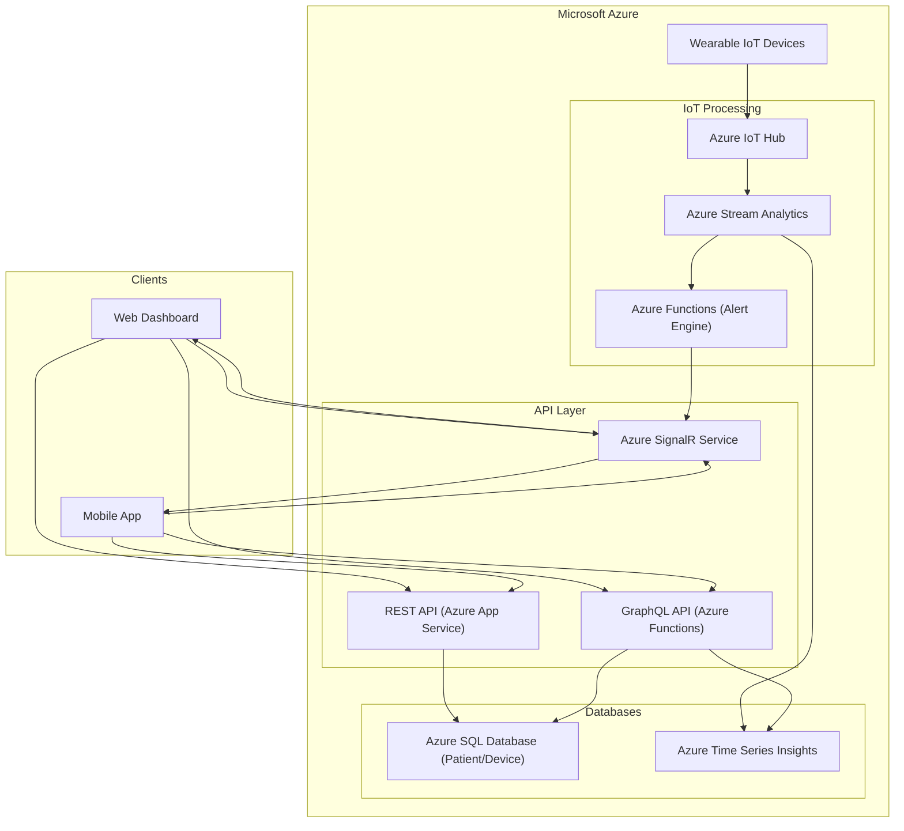

# CST8916-IoT-Remote-Healthcare-Patient-Monitoring

| | |
|---|---|
| **Semester** | Winter 2026 |
| **Release Date** | February 16, 2026 |
| **Authors** | Jingjing Duan, Ilyas Zazai, Mimi Dib |
| **Case** | #4 - Real-time IoT Monitoring System (Healthcare) |

---

[Watch Our Presentation Video!](https://)

## Overview
This report analyzes a conceptual remote data and real-time application solution used to monitor healthcare patients using IoT wearable device sensor management, real time data dashboards and alerts. 

## 1. REST and GraphQL for Data Requests and Updates
In this system, both REST and GraphQL are used to handle different types of data requests and updates.

REST API

REST is used for resource management and standard operations. It is well-suited for clear, structured actions such as creating, updating, or retrieving specific resources.

Examples of REST usage in this system include:

Registering and managing patients

Assigning devices to patients

Retrieving historical vital records

Acknowledging alerts

Updating patient or device information

Typical REST endpoints may include:

POST /patients → Create a new patient resource in the system database.

GET /patients/{id} → Retrieve the profile and details of a specific patient by ID.

GET /patients/{id}/vitals → Retrieve the historical and recorded vital sign data (e.g., heart rate, oxygen level) for a specific patient.

POST /alerts/{id}/ack → Update the status of a specific alert to indicate it has been acknowledged by an authorized user.

REST provides a simple and predictable structure, making it suitable for administrative tasks and CRUD operations.

GraphQL API

GraphQL is used for flexible and efficient data retrieval, especially for dashboard views.

In a healthcare monitoring system, the doctor dashboard may need:

Patient profile information

Latest vital readings

Active alerts

Device status

Instead of making multiple REST calls, GraphQL allows the client to request all required data in a single query.

For example, one GraphQL query can return:

A list of assigned patients

Each patient’s latest heart rate and oxygen level

Any active alerts

GraphQL reduces over-fetching and under-fetching of data and provides greater flexibility for frontend applications.

Design Decision

In this architecture:

REST is primarily used for structured management operations.

GraphQL is used for complex dashboard data queries.

Together, they provide a balanced approach between simplicity and flexibility.

This combination ensures efficient data handling while maintaining clear system structure.

## 2. WebSockets for Real-time Communication
*Describe how WebSockets could be used to handle real-time communication in your chosen system.*

Server needs to push updates to the user frequently WebSocket
Real-time, bidirectional communication needed WebSocket

## 3. Technology Recommendation and Justification
Use Case: Healthcare Remote Patient Monitoring (IoT-based)

### 3.1 Recommendation
For this patient monitoring system, we recommend the use of a hybrid approach:

- REST API for patient and device management (CRUD and operational actions)
- GraphQL API for dashboard queries (flexible, aggregated views across multiple datasets)
- WebSockets (WSS) for real-time vitals streaming and alerts
This combination is appropriate for healthcare monitoring because it balances simplicity, flexibility, and true real-time delivery.

### 3.2 Justification

#### 1) Reasoning of WebSockets for real-time vitals and alerts
Remote monitoring needs the system to push updates instantly (updates vitals, abnormal readings, critical alerts). If the dashboard only used REST/GraphQL polling, clients would often send requests, which would increase cost and delay (especially under high load) With WebSockets, the server maintains a constant connection and can push updates instantly:
- live vitals updates (e.g., heart rate, SpO₂).
- alert notifications when parameters are exceeded.
- device status changes (online/offline, battery low).
- Using a managed real-time layer such as Azure SignalR also helps handle scale (many coinciding clinicians/devices) without running and scaling WebSocket servers manually.

#### 2) Reasoning of REST for management workflows
Tasks like registering devices and onboarding patients, assignments are expected resource-based actions. REST fits well because endpoints are simple and consistent (CRUD-style). it’s easy to test and debug and aligns with “management” flows that are not constantly streaming.

Typical REST responsibilities in this use case:
- patient/device registration
- assigning devices to patients
- updating care plan thresholds
- acknowledging alerts - for clinicians

#### 3) Reasoning of GraphQL for dashboards
Healthcare dashboards usually require a single screen to show multiple datasets at once, for example:
- patient profile
- vitals
- historical trends
- alert history
- device status

With REST, the frontend may need multiple calls (and risk over-fetching or under-fetching) but GraphQL allows the UI to request the fields it needs in one query. THis makes dashboards easier to progress as the UI changes.
**GraphQL is especially useful when the dashboard combines data from:**
- A relational database (patients, clinicians, assignments, care plans).
- A telemetry/time-series store (vital readings over time).

#### 4) Overall reasonging for the hybrid approach
This hybrid approach is the most secure choice because it aligns with how the system behaves in real life:
- streaming and alerts need push → WebSockets.
- structured management actions are simple → REST.
- rich dashboards need flexible combined queries → GraphQL.

**It also supports scalability by separating concerns:**
- IoT ingestion and stream processing deal with high-volume telemetry.
- APIs deal with user-driven requests.
- WebSockets deal with real-time delivery to clients.

### 3.3 Security Considerations (Healthcare Context)
Security is a key justification because the system handles highly sensitive patient data.
- Device security: IoT device identity and secure device-to-cloud communication.
- User security: role-based access control (e.g., doctors can only see assigned patients) using an identity provider such as Azure AD / Entra ID.
- Encrypted transport: TLS everywhere (HTTPS for REST/GraphQL and WSS for WebSockets).

## 4. System Architecture Diagram
*Create a diagram that illustrates the overall architecture of your system, showing how clients, APIs (REST and/or GraphQL), WebSockets, and backend services connect and interact. You may use any diagramming tool (e.g., draw.io, Lucidchart, Excalidraw, Mermaid) and include the diagram as an image in your report.*

**Data Flow**
- Device data ingestion: Wearables send telemetry to Azure IoT Hub. The stream processor validates and stores data in the time‑series database.
- Alerting: The alert engine checks for abnormal values; if found, it triggers a message via the WebSocket server.
- Management APIs: REST endpoints allow staff to register patients and devices (stored in relational DB).
- Dashboard queries: GraphQL fetches combined data from relational and time‑series databases.
- Real‑time updates: WebSocket pushes alerts and live readings to subscribed clients.

## Contribution Statement

- Jingjing
- Ilyas: Technology Recommendation and Justification + healthcare security considerations (Section 3)
- Mimi: Architectural Diagram, WebSockets for Real-time Communication report (Sections 2 & 4)
